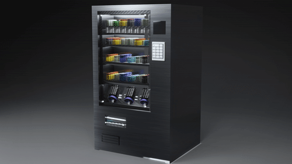

# DHARANEESH
# _Rain In Ocean_

<table>
  <tr>
    <td valign="top"></td>
    <td valign="top"></td>
  </tr>
</table>

Blender is a free and open-source 3D computer graphics software tool set used for creating animated films, visual effects, art, 3D-printed models, motion graphics, interactive 3D applications, virtual reality, and, formerly, video games.

- 3D Graphics.
- 3D Models.
- 3D Animations.

## How To Open My Blender Project

Downloading Blender software in Chrome is a straightforward process. Here are the step-by-step instructions: 

- **Open Google Chrome :** Make sure you have Google Chrome installed on your computer. If you don't have it, you can download and install it from the official [Chrome website](https://www.google.com//).
- **Visit the Blender Website:** In Chrome and go to the official Blender website. You can do this by typing "Blender" into the Google search bar and clicking on the official Blender website link in the search results. Alternatively, you can directly enter the URL, which is "https://www.blender.org/".

- **Navigate to the Download Page:** On the Blender website's homepage, you will see various options and information about Blender. Look for a prominent "Download" or "Get Blender" button. Click on it.

- **Choose Your Operating System:** Blender is available for Windows, macOS, and Linux. Click on the button or link that corresponds to your operating system. This will take you to a page with download options specific to your OS.

- **Select the Download Version:** You'll be presented with different download options. The most common ones are:

   >- __Installer:__ This is the recommended option for most users. It provides an easy installation process.

   >- __Portable:__ This option allows you to run Blender without installing it on your system. It's useful if you want to use Blender on multiple computers without installing it everywhere.
   >- __Other versions:__ You may also see options for experimental or older versions. Choose the one that suits your needs.

- **Click the Download Button:** After selecting your preferred download version, click on the associated download button. This will start the download process.
- **Open the Installer (if applicable):** If you downloaded the installer, locate the downloaded file (usually in your "Downloads" folder) and double-click it to run the installation process. Follow the on-screen instructions to install Blender on your computer.
- **Launch Blender:** Once the installation is complete, you can launch Blender by searching for it in your computer's applications or programs menu. You can also create a desktop shortcut during the installation process for easy access.